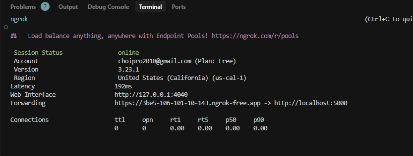
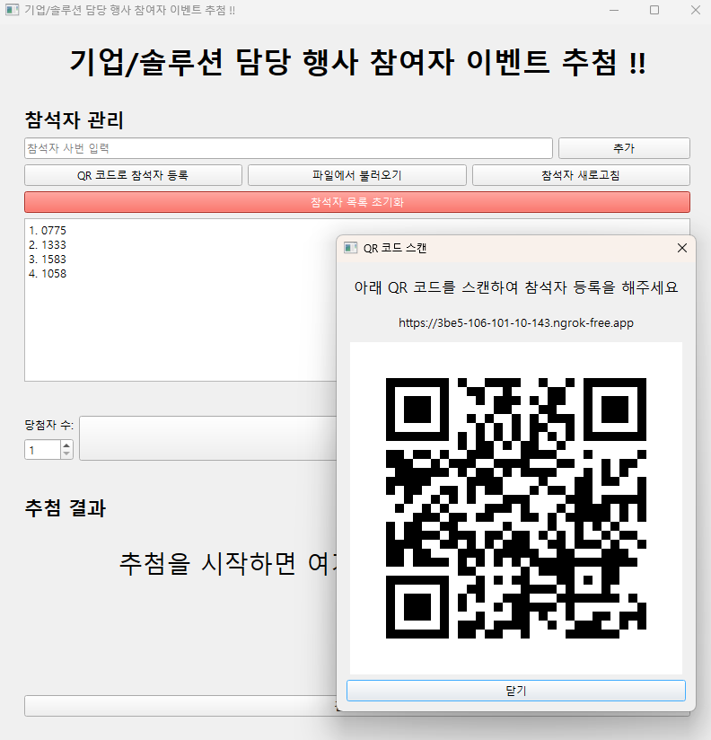
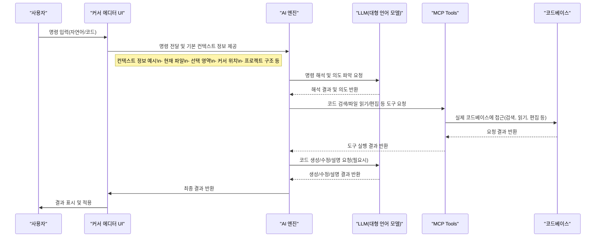

# 커서 AI 로 개발한  추첨 프로그램

## 소개
이 프로그램은 커서 AI 발표 자리에서 약 40명의 참석자들을 대상으로 추첨을 통해 선물을 증정하기 위한 도구입니다. 간단하고 공정한 추첨 과정을 통해 참석자들에게 즐거운 경험을 제공합니다.

## 주요 기능
- 참석자 명단 등록 및 관리
- 무작위 추첨 기능
- 중복 당첨 방지 기능
- 추첨 결과 저장 및 표시
- 직관적인 사용자 인터페이스
- 룰렛 형태의 시각적 효과
- 카운트다운 애니메이션

# python3.10이 설치되어 있다는 가정

## 설치 방법
```bash
# 저장소 복제
git clone https://github.com/medialog-AX-TF/lotto

# 디렉토리 이동
cd lotto

python  -m venv venv
.\venv\Scripts\activate
pip install --upgrade pip setuptools wheel
pip install -r requirements.txt


# 프로그램 실행
python main.py
```

## 외부 접속(ngrok) 사용법
회사 내부 PC에서 외부 접속이 불가능한 경우, ngrok을 사용하여 외부에서도 참석자 등록 페이지에 접속할 수 있습니다.

### 1. ngrok 다운로드
- https://ngrok.com/download 에서 Windows용 ngrok을 다운로드합니다.
- 다운로드한 ngrok.exe 파일을 본 프로젝트 폴더에 위치시킵니다.

### 2. ngrok 실행
먼저 ngrok 인증 토큰을 등록해야 합니다. 아래 명령어를 실행하세요.
```bash
./ngrok.exe config add-authtoken 2rhY0HxZN4jqBZcRHLJ7rn4awDl_2CE7WsvW3YqK1BLgVZkPk
```
(토큰은 ngrok 회원가입 후 https://dashboard.ngrok.com/get-started/your-authtoken 에서 확인할 수 있습니다.)

그 다음 아래 명령어로 ngrok을 실행합니다.
```bash
./ngrok.exe http 5000
```

### 3. 외부 접속 URL 확인
- ngrok 실행 후 터미널에 표시되는 `https://xxxx-xxxx-xxxx.ngrok-free.app`와 같은 URL을 확인합니다.
- 이 URL이 외부에서 참석자 등록에 사용할 주소입니다.

### 4. 프로그램 연동
- 프로그램 내 QR 코드 및 안내 메시지에 ngrok URL이 자동으로 사용됩니다.
- 만약 ngrok URL이 바뀌면 프로그램을 재시작하거나, QR 코드 다이얼로그를 다시 열어 최신 URL이 반영되었는지 확인하세요.

### 5. 주의사항
- ngrok 무료 플랜은 일정 시간이 지나면 연결이 끊길 수 있습니다. 연결이 끊기면 ngrok을 재실행하고, 새로 발급된 URL을 사용하세요.
- 회사 방화벽 정책에 따라 ngrok 사용이 제한될 수 있습니다.

### 6. ngrok URL 설정 파일로 관리
- ngrok URL은 프로젝트 폴더의 config.json 파일에서 관리할 수 있습니다.
- config.json 파일 예시:
```
{
  "ngrok_url": "https://xxxx-xxxx-xxxx.ngrok-free.app"
}
```
- "ngrok_url" 항목에 QR코드에 표시할 ngrok 주소를 입력하세요.
- ngrok 주소가 바뀌면 config.json 파일의 ngrok_url 값을 수정하세요.
- 프로그램을 재시작하면 새로운 URL이 자동으로 반영됩니다.

## ngrok 실행 예시 화면



## 메인 프로그램 실행 예시



## 사용 방법
1. 프로그램을 실행합니다.
2. 참석자 이름을 직접 입력하거나 텍스트/CSV 파일을 불러옵니다.
3. 당첨자 수를 설정합니다.
4. '추첨 시작' 버튼을 클릭하여 당첨자를 선정합니다.
5. 결과를 화면에 표시하고 필요시 저장합니다.

## 파일 형식
### 텍스트 파일
```
홍길동
김철수
이영희
...
```

### CSV 파일
```
이름,소속
홍길동,개발팀
김철수,디자인팀
...
```
CSV 파일의 경우 첫 번째 열의 이름만 사용됩니다.

## 기술 스택
- Python 3.8+
- PyQt6 (GUI)
- 기본 Python 라이브러리 (random, time 등)

## 라이센스
MIT License

## 개발자 정보
이 프로그램은 커서 AI의 도움을 받아 개발되었습니다.

## 연락처
문의사항은   최프로 choipro@medialog.co.kr  로 연락해 주세요. 


# 커서 AI 시퀀스 다이어그램

> **참고:**
> - AI 엔진은 커서 에디터 내부(또는 확장/플러그인 형태)에서 동작하며, 커서와 긴밀하게 통합되어 있습니다. 사용자의 명령은 커서 내부의 AI 엔진으로 전달되어 해석·처리되고, 필요시 외부 LLM 및 MCP Tools와 통신하여 결과를 반환합니다.
> - **MCP Tools(코드 검색, 파일 읽기, 편집 등)는 커서 AI(또는 커서 에디터) 내부에 포함되어 있거나, 내부에서 직접 제어 가능한 구조로 통합되어 있습니다.**

아래는 커서 AI의 주요 동작 흐름을 나타내는 상세 시퀀스 다이어그램입니다.



